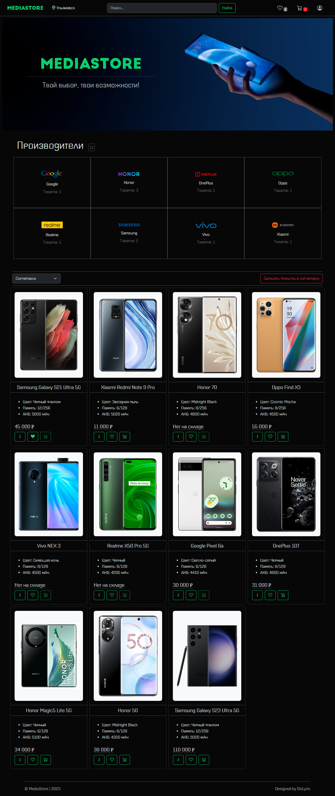
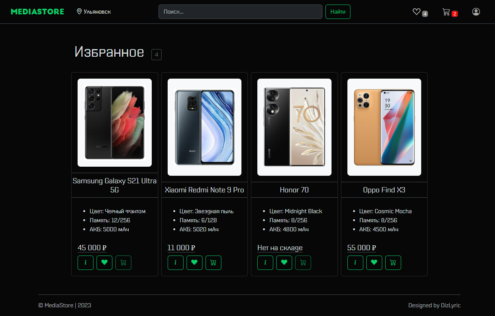
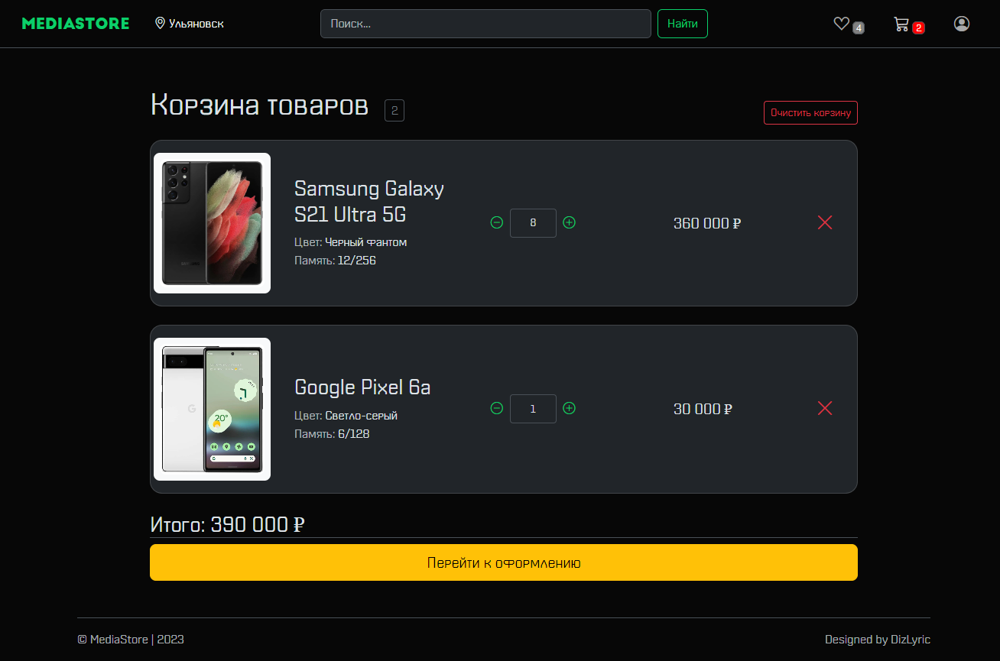
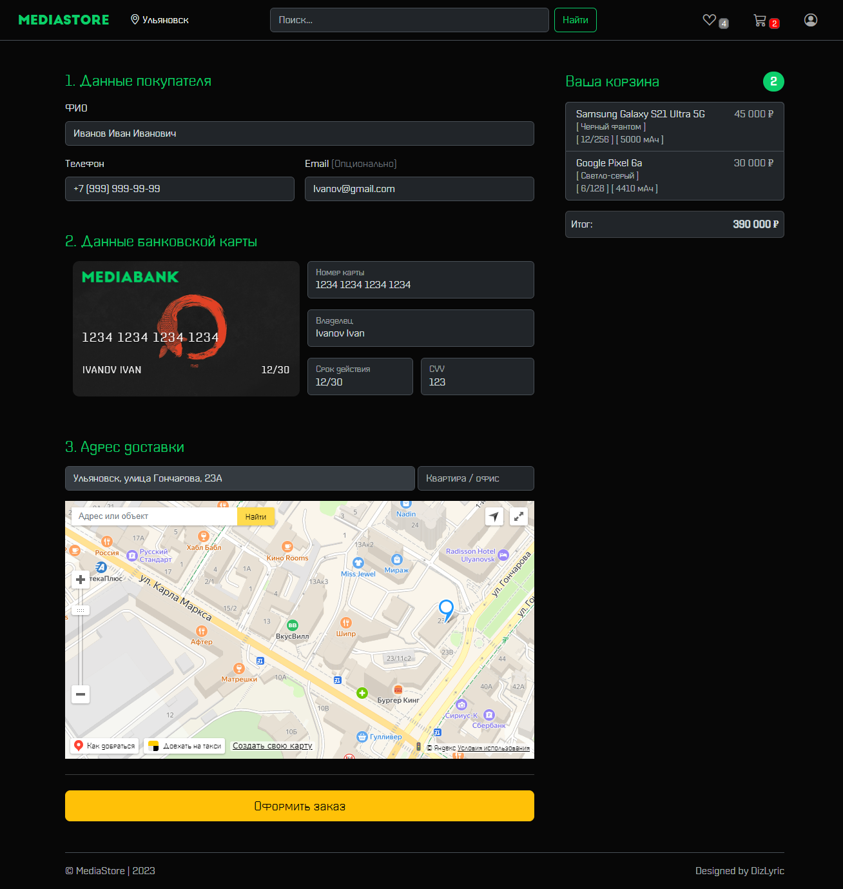

# MediaStore - Интернет-магазин смартфонов

**MediaStore** - современный интернет-магазин смартфонов с интуитивно понятным интерфейсом и широким функционалом, разработанный с использованием передовых технологий.

## 🖼️ Скриншоты интерфейса

### 1. Главная страница

### 2. Избранное

### 3. Корзина

### 4. Оформление заказа

## 🚀 Ключевые функции

- 📱 **Вывод товаров** с возможностью пагинации
- 🔄 **Сортировка** по названию и цене (возрастание/убывание)
- 🎯 **Фильтрация** по производителю
- 🔍 **Поиск** по названию товара
- 📖 **Детальная информация** о каждом товаре
- ❤️ **Добавление в избранное** (избранные товары сохраняются)
- 🛒 **Корзина** с возможностью изменения количества товаров
- 💳 **Оформление заказа** с анимированной банковской картой
- 🗺️ **Указание адреса** через Yandex Maps API

## 🛠️ Технологический стек

Проект реализован с использованием следующих технологий:

- **Frontend**: React с использованием функциональных компонентов и хуков
- **State Management**: Redux для управления состоянием приложения
- **Routing**: React Router для навигации между страницами
- **Build Tool**: Vite для быстрой сборки проекта
- **UI**: Bootstrap для адаптивного дизайна
- **API**: Интеграция с Yandex Maps API для функционала карты

## ✨ Особенности реализации

- Оптимизированная загрузка товаров
- Адаптивный дизайн для всех устройств
- Плавные анимации интерфейса
- Валидация форм при оформлении заказа
- Сохранение состояния корзины и избранного между сессиями

> Проект демонстрирует современные подходы к разработке интернет-магазинов с акцентом на пользовательский опыт.